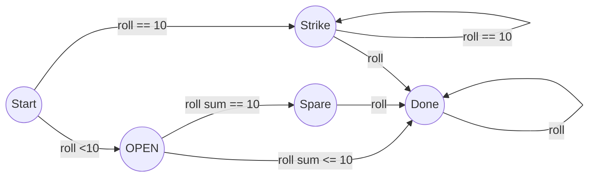

# Bowling Rules

- Open frame - If less than 10 pins are knocked down in a frame, the frame is considered open.

- Spares - if all 10 pins are knocked down over 2 rolls, you get 10 points plus the number of pins knocked down in the next roll.

- Strikes - If all 10 pins are knocked down in a single roll you earn 10 points plus the sum of your next two rolls. 

- 10th frame - 10th frame scoring works as so:
  - If you roll a strike on the first attempt you get two more rolls.
  - If you roll a spare in the first two attempts you get one more roll.
  - If you roll an open frame, your turn is over.

---

# State Machine for a frame

